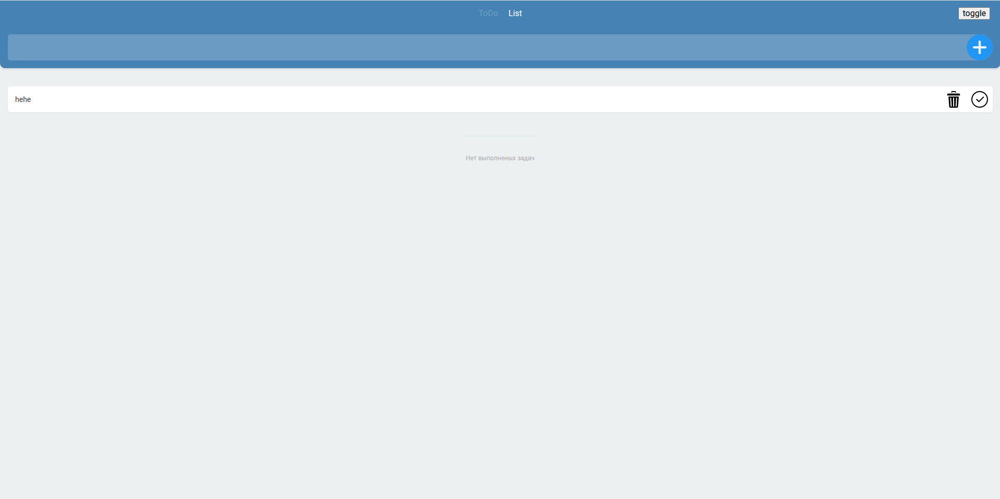
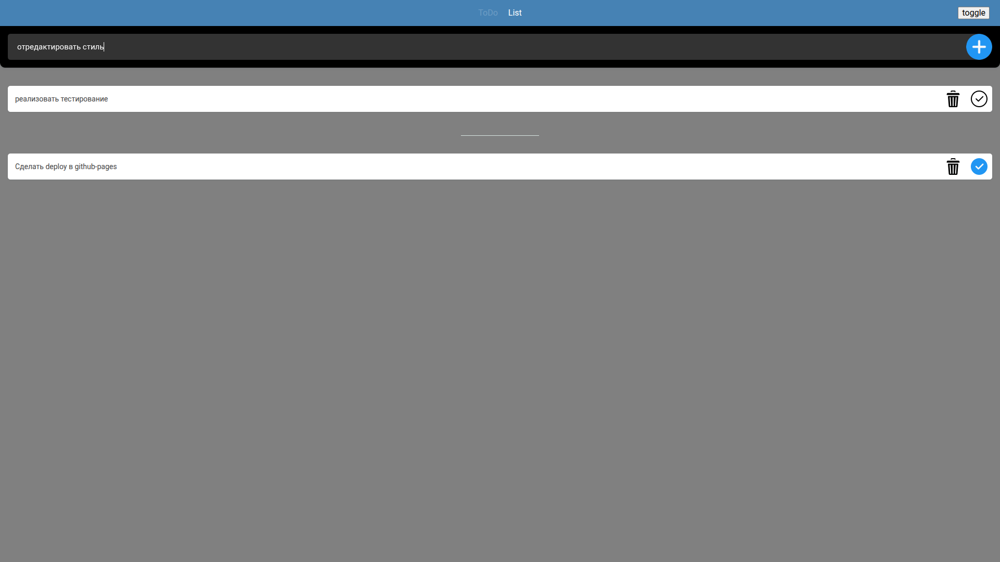

# React ToDo List

**English** | [Русский](README.ru.md)

A ToDo app built with React and TypeScript: global state with Redux Toolkit, client-side routing, a light/dark theme switch, and data persisted in `localStorage`.

A training project completed during a React intensive by GloAcademy. Each day of the course added a new technology to the app (see [Development stages](#development-stages)). The UI is in Russian.

**[Live demo → barbarafromtonshaevo.github.io/react-todo-list](https://barbarafromtonshaevo.github.io/react-todo-list/)**

## Screenshots

| Light theme | Dark theme |
| --- | --- |
|  |  |

## Features

- add and delete tasks, mark them as done;
- done and pending tasks are shown in separate lists;
- a page with all tasks and a page for a single task (`/list/:id`);
- light and dark theme toggle;
- tasks and the selected theme are saved to `localStorage` and survive a page reload;
- a 404 page for unknown routes.

## Tech stack

| Area | Technologies |
| --- | --- |
| UI | React 19, TypeScript |
| State | Redux Toolkit, React Redux |
| Routing | React Router 7 (`createBrowserRouter`) |
| Styling | styled-components (dynamic themes), SCSS / CSS Modules, styled-normalize |
| Other | uuid, Create React App (react-scripts 5), Testing Library |

## Getting started

Requires Node.js and npm.

```bash
git clone https://github.com/BarbaraFromTonshaevo/react-todo-list.git
cd react-todo-list
npm install
npm start
```

The app opens at [http://localhost:3000/react-todo-list](http://localhost:3000/react-todo-list).

### Scripts

| Command | Description |
| --- | --- |
| `npm start` | dev server with hot reload |
| `npm run build` | production build into the `build` folder |
| `npm test` | run tests in watch mode |
| `npm run deploy` | build and publish to GitHub Pages (`gh-pages` branch) |

## Routes

| Path | Page |
| --- | --- |
| `/` | add form and task lists |
| `/list` | all tasks as links |
| `/list/:id` | single task page |
| `*` | 404 page |

## Project structure

```
src/
├── components/   # Form, Header, ListItem, ToDoList, ToDoListItem
├── feature/      # Redux slices: todoList, themeList
├── helpers/      # localStorage helpers
├── layouts/      # Layout: ThemeProvider, GlobalStyle, Header, Outlet
├── models/       # ToDo and Theme types
├── pages/        # ToDoListPage, ViewListPage, ViewListItemPage, 404
├── styles/       # GlobalStyle and theme definitions
├── router.tsx    # route configuration
├── store.ts      # Redux store + persisting state to localStorage
└── index.tsx     # entry point
```

## How it works

- **State.** Two Redux Toolkit slices: `todoList` (create, toggle status, delete) and `themeList` (current theme). The store subscribes to changes and writes the state to `localStorage`; on startup it reads it back as `preloadedState`.
- **Themes.** Colors are defined in `styles/themes.ts`. The current theme from Redux is passed to styled-components' `ThemeProvider`, so components read colors from `props.theme`.
- **Routing.** `Layout` renders the header and an `<Outlet />`; nested pages are rendered inside it.

## Deployment

The app is published to GitHub Pages with the `gh-pages` package. Since Pages knows nothing about client-side routes, direct visits to `/list` and `/list/:id` are handled with the [spa-github-pages](https://github.com/rafgraph/spa-github-pages) approach: `public/404.html` redirects to `index.html`, and a script there restores the original path. The router uses a `basename` derived from `homepage`.

## Development stages

The commit history follows the course program:

1. React basics: components, state, forms
2. React Routing (two approaches: old and new)
3. Redux (Redux Toolkit)
4. Styled-components
5. Dynamic color themes

## Roadmap

- edit task text;
- tests for slices and components.
