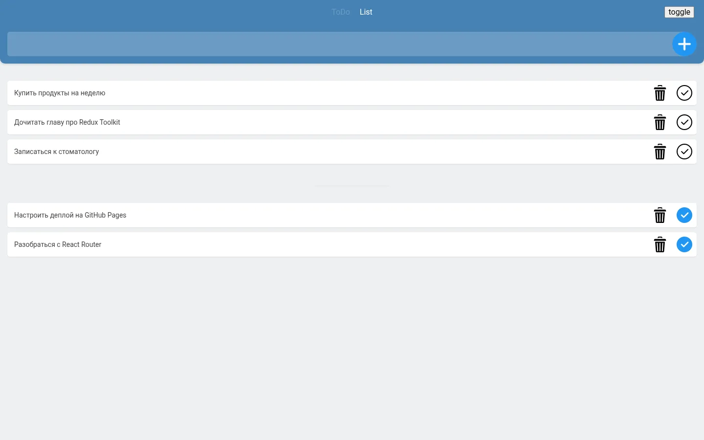
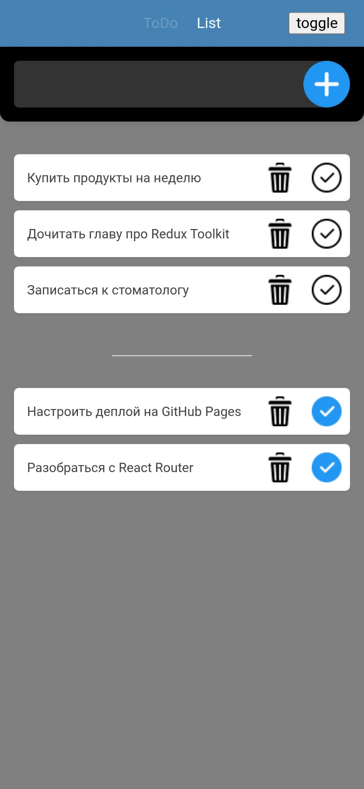

# React ToDo List

**English** | [Русский](README.ru.md)

A ToDo app built with React 19 and TypeScript: Redux Toolkit for state, React Router for pages, styled-components for a light/dark theme, and `localStorage` for persistence. The UI is in Russian.

> 🎓 **Training project** · GloAcademy React intensive · October 2025. Each day of the intensive added one new technology to the app; after it I fixed bugs, styled the 404 page and set up GitHub Pages (see [Changed afterwards](#changed-afterwards)).

**Live demo:** https://barbarafromtonshaevo.github.io/react-todo-list/

<p>
  
  
</p>

## Features

- Add and delete tasks, mark them as done.
- Done and pending tasks are shown in separate lists.
- A page with all tasks and a page for a single task.
- Light and dark theme toggle.
- Tasks and the selected theme survive a page reload.
- A 404 page for unknown routes and deleted tasks.

## Tech stack

| Area | Tools |
| --- | --- |
| UI | React 19, TypeScript |
| State | Redux Toolkit, React Redux |
| Routing | React Router 7 (`createBrowserRouter`) |
| Styles | styled-components (themes), SCSS / CSS Modules, styled-normalize |
| Build | Create React App (react-scripts 5) |
| Hosting | GitHub Pages (`gh-pages`) |

## Architecture

```
Form / buttons ──► todoList, themeList slices ──► store ──► localStorage ("appState")
                                                    │
                                                    ▼
                         Layout (ThemeProvider + Header) ──► <Outlet /> ──► pages
```

1. [src/feature/todoList.ts](src/feature/todoList.ts) creates, toggles and deletes tasks; [src/feature/themeList.ts](src/feature/themeList.ts) holds the current theme.
2. [src/store.ts](src/store.ts) subscribes to changes and writes the state to `localStorage`; on startup it reads it back as `preloadedState` ([src/helpers/storage.ts](src/helpers/storage.ts)).
3. [src/layouts/Layout.tsx](src/layouts/Layout.tsx) passes the theme from Redux to styled-components' `ThemeProvider`, so components read colors from `props.theme`. The colors are defined in [src/styles/themes.ts](src/styles/themes.ts).
4. [src/router.tsx](src/router.tsx) renders all pages inside `Layout` through `<Outlet />`.

### Routes

| Path | Page |
| --- | --- |
| `/` | add form and task lists |
| `/list` | all tasks as links |
| `/list/:id` | single task page |
| `*` | 404 page |

### Development stages

The commit history follows the intensive, one technology per day:

1. React basics: components, state, forms.
2. React Router, first the old approach, then `createBrowserRouter`.
3. Redux Toolkit.
4. styled-components.
5. Dynamic color themes.

## Project structure

```
src/
├── components/   # Form, Header, ListItem, ToDoList, ToDoListItem
├── feature/      # Redux slices: todoList, themeList
├── helpers/      # localStorage helpers
├── layouts/      # Layout: ThemeProvider, GlobalStyle, Header, Outlet
├── models/       # ToDo and Theme types
├── pages/        # ToDoListPage, ViewListPage, ViewListItemPage, 404
├── styles/       # GlobalStyle and theme definitions
├── router.tsx    # route configuration
├── store.ts      # Redux store + persisting state to localStorage
└── index.tsx     # entry point
```

## Changed afterwards

- **The form no longer submits the page:** the submit handler calls `preventDefault()`.
- **Task links open inside the app:** a plain `<a target="_blank">` in the task list was replaced with a router `Link`.
- **The task page shows the task** (text and status) instead of its id.
- **A styled 404 page**, now rendered inside `Layout`, and Russian page titles.
- **GitHub Pages setup:** `basename` for the router and the redirect for direct visits (see [Deployment](#deployment)), this README and the screenshots.

## Getting started

Requires Node.js and npm.

```bash
npm install
npm start            # http://localhost:3000/react-todo-list
```

Other scripts:

```bash
npm run build        # production build into build/
npm run deploy       # build and publish to GitHub Pages (gh-pages branch)
```

## Deployment

Published to GitHub Pages with the `gh-pages` package. Pages knows nothing about client-side routes, so direct visits to `/list` and `/list/:id` use the [spa-github-pages](https://github.com/rafgraph/spa-github-pages) approach: [public/404.html](public/404.html) redirects to `index.html`, and a script there restores the original path. The router's `basename` comes from `homepage` in `package.json`.

## Known limitations

- The header ignores the theme: its color is hard-coded in [Header.module.scss](src/components/Header/Header.module.scss).
- The header labels (`ToDo`, `List`, `toggle`) are in English while the rest of the UI is in Russian.

## What I'd improve

- **Editing task text.** Right now a task can only be toggled or deleted.
- **Tests for the slices and components.** Testing Library came with Create React App, but no tests were written.
